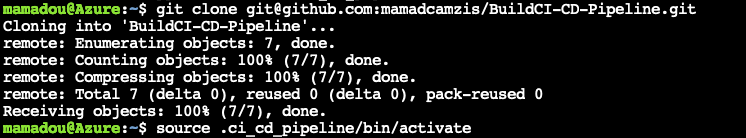
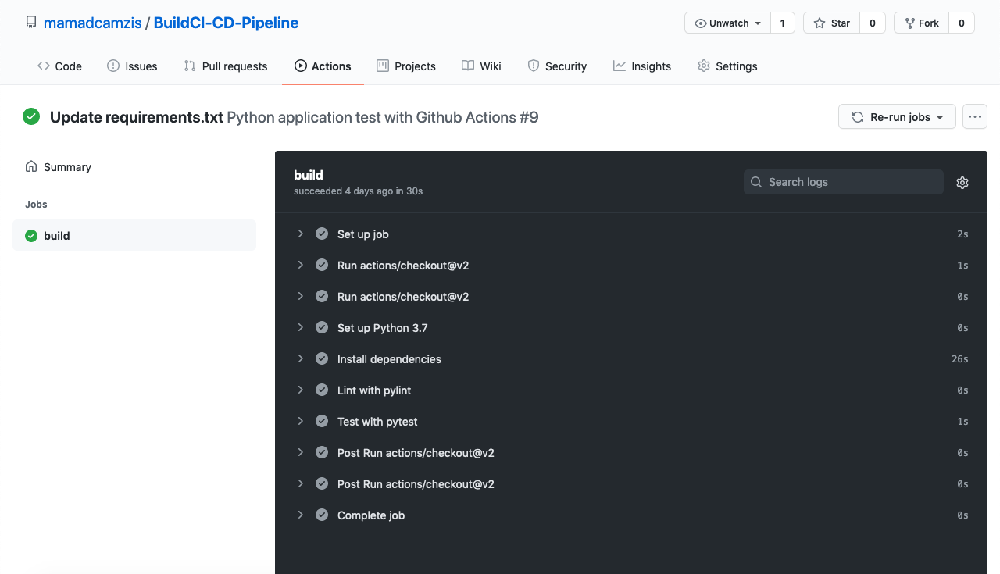
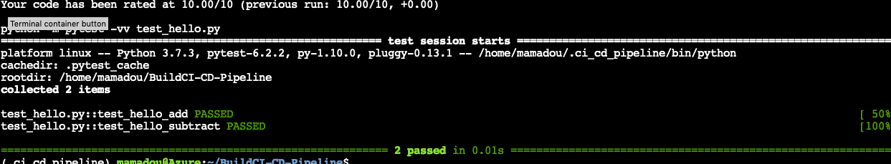
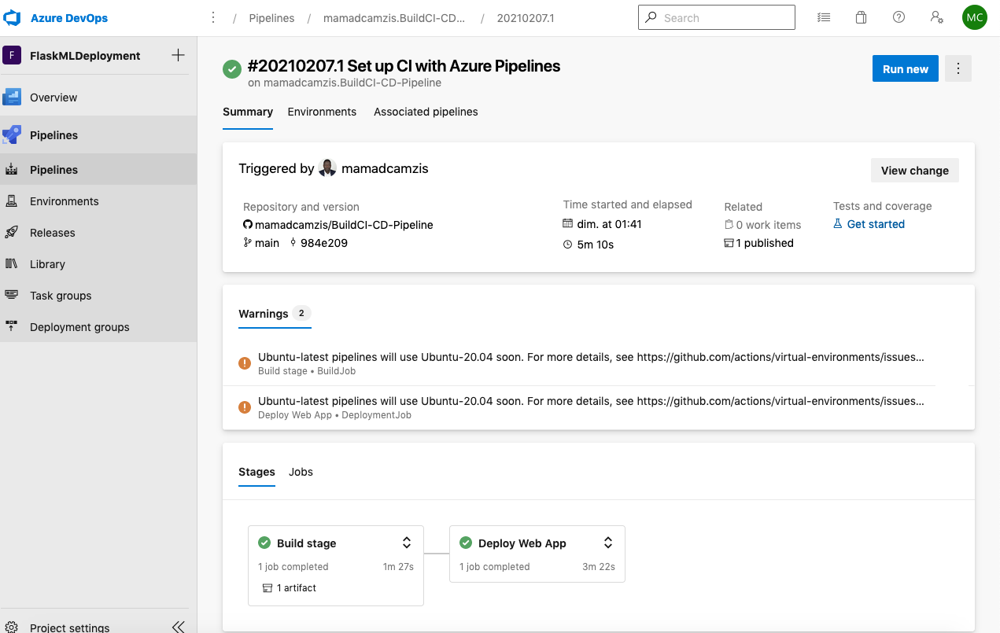
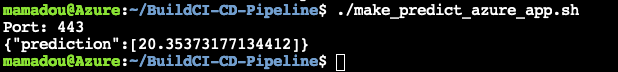
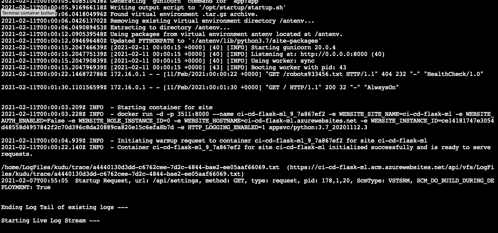

# Overview
This a  project from Udacity to build CI/CD pipeline using GitHub actions and azure pipeline 
to deploy a flask app on Azure

## Project Plan

* A link to a Trello board for the project [Trello planning project](https://trello.com/b/vV1MJiMx/building-a-ci-cd-pipeline)
* A link to a spreadsheet that includes the original and final project plan> [spreadsheet project management](https://docs.google.com/spreadsheets/d/1-7xYcPvTTA3If3X05Kf7Lqj8NJUzzYQn/edit#gid=224114949)

## Instructions


* Architectural Diagram 


* Project running on Azure App Service
Use azure CLI to create a web app. I this case I first create a resssource group and then create azure web app by following command.

```bash
az group create -n flask-ml-gr
az webapp up -n ci-cd-flask-ml -g flask-ml-gr

```

* Project cloned into Azure Cloud Shell
Open azure coud shell, activate the virtualenv and clone the project

```bash
python -m venv ~/.azure_ci_cd_pipeline
git clone git@github.com:mamadcamzis/BuildCI-CD-Pipeline.git
soucre ~/.azure_ci_cd_pipeline/bin/activate
cd BuildCI-CD-Pipeline
```

* Passing tests that are displayed after running the `make all` command from the `Makefile`



* Output of a test run




* Successful deploy of the project in Azure Pipelines.  



* Running Azure App Service from Azure Pipelines automatic deployment

* Successful prediction from deployed flask app in Azure Cloud Shell.  


```bash
mamadou@Azure:~/BuildCI-CD-Pipeline
Port: 443
{"prediction":[20.35373177134412]}
```


* Output of streamed log files from deployed application




## Enhancements

This project can be enhanced by many approaches:

- Add more unit test
- Enhanced predictions model
- Infrastrcture depolyment should be automated

## Demo 

<TODO: Add link Screencast on YouTube>


